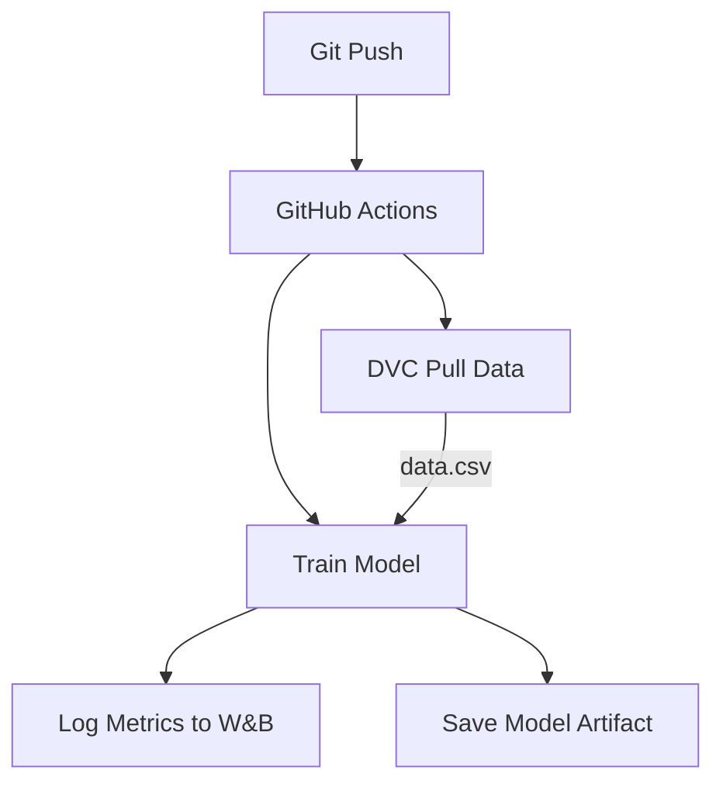

# 🚀 End-to-End MLOps Workflow with GitHub Actions, DVC & Weights & Biases


A production-grade MLOps pipeline demonstrating automated training, data versioning, experiment tracking, and model management.

## 🌟 Key Features

| Feature                | Technology Stack | Benefits |
|------------------------|------------------|----------|
| **Automated Training** | GitHub Actions   | Trigger model training on every git push |
| **Data Versioning**    | DVC + Google Drive | Track dataset versions without bloating Git |
| **Experiment Tracking**| Weights & Biases | Visualize metrics, compare runs |
| **Artifact Storage**   | GitHub Artifacts | Store trained models for deployment |

## 🏗️ Project Architecture



## 🛠️ Setup & Usage

### Prerequisites
- Python 3.8+
- Git
- DVC
- W&B account

### Installation

```bash
# Clone repository
git clone https://github.com/Hasee10/ML_ST.git
cd ML_ST

# Set up Python environment
python -m venv venv
source venv/bin/activate  # On Windows: venv\Scripts\activate

# Install dependencies
pip install -r requirements.txt
```

### Configuration

1. **Weights & Biases**:
   ```bash
   wandb login
   ```

2. **DVC Remote Storage**:
   ```bash
   dvc remote add --default myremote gdrive://1uGtJsdEwErQsuhUrLdMbPqM-emeQU6ow?usp=drive_link
   ```

### Running the Pipeline

```bash
# Pull data
dvc pull

# Run training locally
python model.py

# Push changes (triggers CI/CD)
git add .
git commit -m "Update model"
git push
```

## 📂 Repository Structure

```
ML_ST/
├── .github/
│   └── workflows/
│       └── run-model.yml        # CI/CD pipeline definition
├── data/
│   ├── data.csv.dvc             # DVC pointer file
│   └── raw/                     # Raw datasets
├── models/                      # Trained models
├── src/
│   └── model.py                 # Training script
├── .dvc/                        # DVC config
├── requirements.txt             # Python dependencies
└── README.md                    # This documentation
```

## 📊 Monitoring & Results

All training runs are automatically tracked in Weights & Biases:

[](https://wandb.ai/your-username/mlops-demo)

Example metrics tracked:
- Accuracy
- Precision/Recall
- Training time
- Model size

## 🤝 Contributing

We welcome contributions! Please follow these steps:
1. Fork the repository
2. Create a new branch (`git checkout -b feature/your-feature`)
3. Commit your changes (`git commit -m 'Add some feature'`)
4. Push to the branch (`git push origin feature/your-feature`)
5. Open a Pull Request

## 📜 License

This project is licensed under the MIT License - see the [LICENSE](LICENSE) file for details.

## ✉️ Contact

For questions or suggestions, please contact:
- Haseeb Arshad(mailto:ihaseebarshad10l@gmail.com)
- Hasee10(https://github.com/Hasee10/ML_ST/issues)
```

